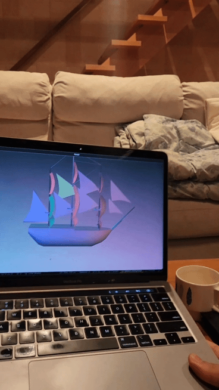

# Simple Parallax Demo

Keywords: Oblique projection, Off-axis projection, depth-illusion, realsense

## Sample

Above: `python main.py samples/data/ship.egg configs/laptops/sample.json --distance 500 --model-hpr "(90, 0, 0)" --track cv2`

Below: `python main.py samples/data/ship.egg configs/sample_realsense.json --model-hpr "(90, 0, 0)" --track realsense`

## Run

1. Prepare a scene for panda3d to render. [Converting from Blender](https://docs.panda3d.org/1.10/python/tools/model-export/converting-from-blender)
2. [Describe your setup](configs/sample_realsense.json)
3. run using `python main.py samples/data/ship.egg configs/sample_realsense.json --model-hpr "(90, 0, 0)"`
   1. For usual webcam, add `--distance $DISTANCE --track cv2` where `$DISTANCE` is the distance from viewer to the camera
   2. For realsense cameras, add `--track realsense`

## How it works

1. Your face location is estimated.
2. In virtual scene, it will place the camera at your face location.
3. In virtual scene, the monitor is placed in a designated place. It will acts as the film.
4. The scene is rendered on the film.
5. Displays the scene on the monitor.

## Limitation

People (mostly) have two eyes. From which a slight difference from two views are used to capture depth. Such depth perception can only be achieved by showing two different images for each eye. They are called stereoscopic displays. In 2023, the most common form is head-mount displays (HMDs) or plenoptic illumination displays (also known as Tensor display, Spatial Reality Display, or Light Field Display; they are x20 more expensive than their LCD counterparts).

On top of that, our eyes have lenses called cornea. We can only see an object properly by changing the curvature of cornea. [When the object seems far but the focus is close](https://en.wikipedia.org/wiki/Vergence-accommodation_conflict), or the other way around, it can feel very wrong. Because of that, the object rendered in the scene should not be too far from display itself.

## Note for Devs

In the code, you will find 3 different coordinate systems.
- Image coordinates (2D): Left-handed Y down
- Panda3D coordinates (3D): Right-handed Z up
- OpenGL coordinates (3D): Right-handed Y up

## TODO

- [x] Single web camera
- [x] Intel realsense (Linux/Windows only)
- [ ] Direct rendering of fisheye image
- [ ] Light Field Display (Output as plenoptic function)
- [ ] StereoLabs - ZED series
- [ ] Poorly calibrated multiple web cameras
- [ ] Easily configurable HDRI
- [ ] Animated scene

## References & Inspirations

- 1977 [GENERAL CLIPPING ON AN OBLIQUE VIEWING FRUSTRUM](https://dl.acm.org/doi/pdf/10.1145/563858.563898)
- 1992 [The CAVE: audio visual experience automatic virtual environment](https://doi.org/10.1145%2F129888.129892)
- 2008 [Johnny Lee](https://www.youtube.com/watch?v=Jd3-eiid-Uw)
- 2014 [Amazon Firephone](https://en.wikipedia.org/wiki/Fire_Phone)
- [Daito Manabe](https://daito.ws/en/)
